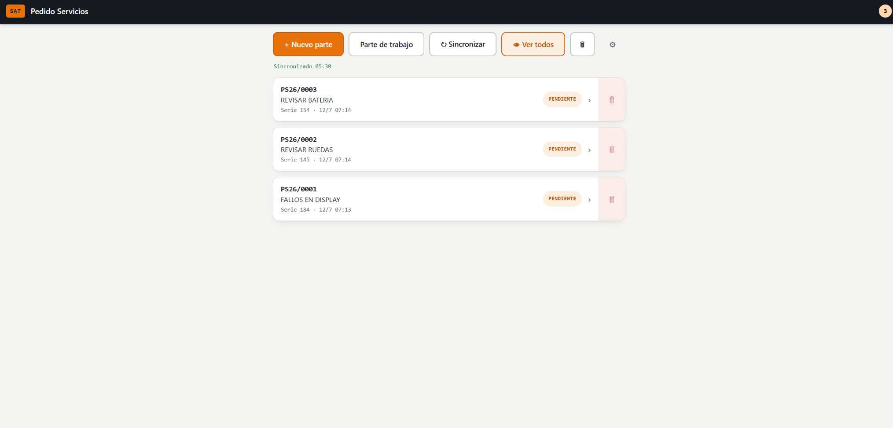
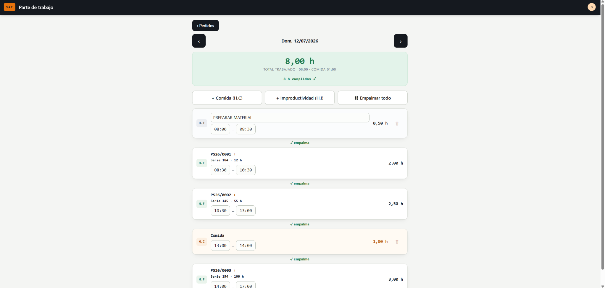

# Pedido Servicios

**PWA _offline-first_** para que un técnico de campo capture sus partes de
trabajo aunque no tenga cobertura, y los sincronice entre sus dispositivos
cuando recupera conexión.

[**🔗 Ver la app en vivo**](https://adrianzgzdev.com/partes/)

---

Nace de una necesidad real de campo: sin red no se pueden registrar los partes
en el momento, así que al recuperar cobertura toca rehacerlos de memoria. Esta
herramienta los guarda en el propio dispositivo y los deja listos para volcar,
sin perder ningún dato por el camino.

## Capturas

| Lista de partes | Parte de trabajo (jornada) |
| :---: | :---: |
|  |  |

## Qué hace

- **Captura de partes**: nº de pedido, máquina, cliente, horas del contador,
  comentarios de resolución y defecto, productos imputados y horas de trabajo.
- **Parte de trabajo (jornada)**: monta el timeline del día con todas las líneas
  de horas, suma el total, detecta huecos y solapes entre tramos y permite
  empalmarlos para cuadrar la jornada. Marca el restante para las 8 h y admite
  líneas de **comida** (H.C, no computa) e **improductividad** (H.I, con
  descripción libre y sí computa), que se colocan solas en el primer hueco libre.
- **Horas por día en un mismo pedido**: cada línea de horas lleva su propia
  fecha, así se puede trabajar varios días sobre el mismo parte sin duplicarlo.
- **Papelera**: los borrados son reversibles; una PS eliminada por error se
  restaura desde la papelera y la restauración se propaga a los demás
  dispositivos.
- **Copiado por casilla**: cada campo se copia por separado para volcarlo rápido
  al sistema de gestión.
- **100% sin conexión** e **instalable** como app (PWA).
- **Sincronización entre dispositivos**: los partes se guardan primero en local
  y, cuando hay red, se sincronizan con un backend propio protegido por token.

## Arquitectura y decisiones técnicas

El proyecto es **local-first**: el dispositivo es siempre la fuente de la verdad
y el servidor actúa solo como capa de sincronización, no como almacén principal.
Eso garantiza que la app siga funcionando al 100 % sin cobertura y que la red
sea un extra, nunca un requisito.

- **Frontend (este repo)**: HTML, CSS y JavaScript _vanilla_, **sin frameworks
  ni dependencias externas**, en un único `index.html`. Decisión deliberada para
  máxima robustez offline: nada que se caiga por una CDN. Sitio estático
  desplegado en GitHub Pages.
- **PWA**: Web App Manifest + Service Worker con estrategia _cache-first_, para
  que arranque al instante y funcione sin red. Instalable en móvil y escritorio.
- **Persistencia local**: `localStorage`, con migración segura de claves
  (copiar-y-conservar en vez de renombrar, para no destruir datos guardados).
- **Sincronización**: API propia en **Node.js + Express** sobre **PostgreSQL**.
  Dos relojes con responsabilidades separadas: la resolución de conflictos es
  **_last-write-wins_** por la hora de edición del **cliente** (`actualizado`),
  mientras que la descarga **incremental** se filtra por la hora del **servidor**
  (`recibido`), monótona y a prueba de desfases de reloj entre dispositivos. Los
  borrados son **lógicos**, para que una baja en un dispositivo se propague al
  resto y siga siendo reversible.
- **Seguridad**: acceso a la API protegido con **token** (`Authorization:
  Bearer`), comparado en tiempo constante con SHA-256 + `timingSafeEqual`. El
  token nunca vive en el código; se inyecta como variable de entorno en el
  servidor.
- **Infra**: contenedores Docker gestionados con EasyPanel y HTTPS vía Traefik.

> El código del backend vive en un repositorio privado aparte.

## Stack

`JavaScript (vanilla)` · `HTML` · `CSS` · `PWA / Service Worker` ·
`Node.js` · `Express` · `PostgreSQL` · `Docker` · `Traefik`

## Uso

Se abre una vez con conexión (para que se cachee) y a partir de ahí funciona sin
red. Para instalarla en la pantalla de inicio: en Android desde el menú del
navegador, en iPhone con **Compartir → Añadir a pantalla de inicio**, y en
escritorio desde el icono de instalar de la barra de direcciones.

## Estructura

- `index.html` — la aplicación completa (HTML + CSS + JS en un solo archivo).
- `manifest.json` — metadatos e iconos para la instalación.
- `service-worker.js` — caché para el funcionamiento offline.
- `favicon.svg`, `icon-192.png`, `icon-512.png`, `icon-512-maskable.png` — iconos.
- `capturas/` — imágenes usadas en este README.

## Despliegue

El frontend es un sitio totalmente estático: basta servir estos archivos en
cualquier hosting estático con HTTPS. Las rutas son relativas, así que también
funciona alojado en una subcarpeta.